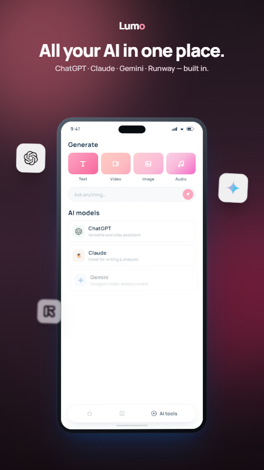
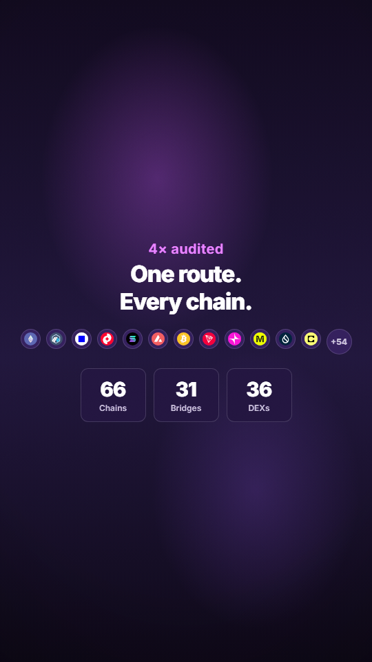
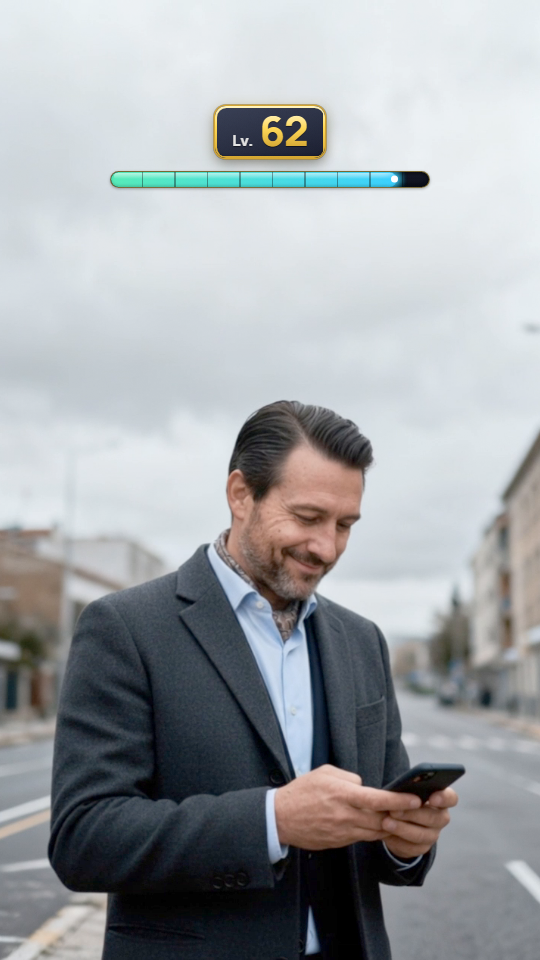
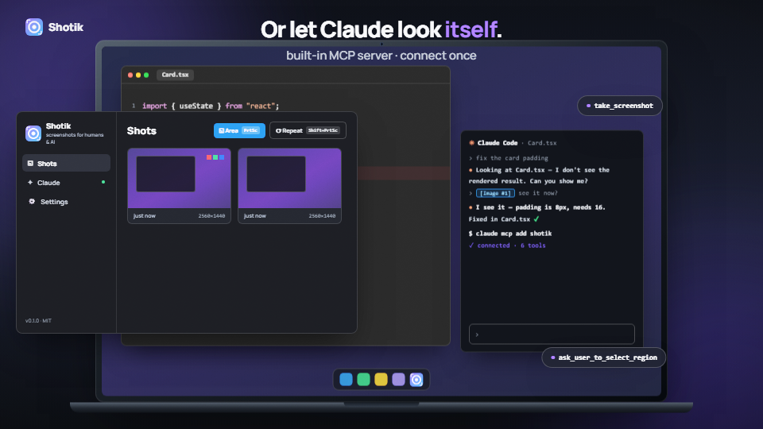
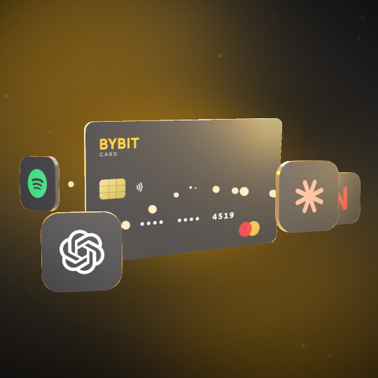

<h1 align="center">motion-engine</h1>

<p align="center">
  <strong>Product & promo videos, written as React code and rendered locally to mp4.</strong><br>
  A reusable <a href="https://www.remotion.dev/">Remotion</a> engine — one parametrized base, many brands, RU/EN, 9:16 / 1:1 / 16:9.
</p>

<p align="center">
  
  <a href="https://github.com/gorka2354/motion-engine/actions/workflows/ci.yml"></a>
  
  
  
  
</p>

<p align="center">
  
  
  
</p>
<p align="center"><sub><b>One toolkit, wildly different looks</b> — a floating-phone edtech promo, a crypto bridge, an AI-cinematic creative. Each is a theme preset + a data-driven scene map on the shared primitives.</sub></p>

---

Write the video in React, get a deterministic mp4. The whole storyline is **data** (a
zod-validated scene map you can override with a JSON file), the look is **design tokens**, and
the motion is a library of **premium primitives** — so a new brand, language, or aspect ratio is
a preset, not a rewrite. Rendering is **100% local** (Remotion drives headless Chromium; no API
key needed to render).

> **Two things live here.** The **engine** (`src/lib`, `src/theme`, `src/device`, `src/v2`) is
> the reusable product — that's what you build on. The **example builds** (`src/lumo`,
> `src/jumper`, `src/shotik`, `src/bybit`, `src/creative`) are finished videos that show what the
> engine produces and *how* to build your own. **`src/lumo` is the reference example** the
> "Author a promo" section walks through.

<p align="center">
  
  
</p>
<p align="center"><sub>Not just phones: <b>16:9 laptop frames</b> and <b>real 3D</b> (@remotion/three + a Blender→GLB pipeline). An <b>AI-asset layer</b> (top right) generates footage and composites a Remotion UI on top.</sub></p>

## Why it's interesting
- **Author without touching JSX** — a promo is a scene map (typography beats, in-device
  navigation, floats, brand copy) validated by a **zod schema**. Edit the map, tweak props live in
  Studio, or pass `--props=client.json` to re-skin a whole video.
- **Multi-brand by construction** — a floating-phone promo = *theme preset + product screens +
  scene map + a thin wrapper*. The `src/lumo` example proves the pattern; `jumper` / `shotik` /
  `bybit` / `creative` show the engine's range (crypto, 16:9 desktop, 3D, AI-hybrid).
- **A real test pyramid (L0–L6)** for a medium that's notoriously hard to test — geometry/orbit
  invariants reject a clipping 3D orbit *arithmetically before rendering*; a determinism guard
  greps for `Math.random`; browser-mode layout tests catch "child escaped its container"; a pixel
  self-check catches "stills pass, the video is broken". See [`docs/TESTING.md`](docs/TESTING.md).
- **Hard-won craft, encoded** — spring entrances, real motion blur on camera moves, film grain, a
  continuous camera rig, and a running log of headless-render footguns (collapsible below).
- **Self-contained** — fonts, sound (a DSP-synthesized SFX set), and assets ship in the repo; the
  core render needs no external service.

## Quick start
```bash
npm install
npm run dev          # Remotion Studio — live preview, edit props in the UI
npm run lint         # eslint + tsc (strict)
npm test             # vitest — geometry/orbit invariants, anim math, determinism guard, scene-graph
```
Render (run from the project dir so `public/` assets resolve):
```bash
npx remotion render LumoPromo out/promo.mp4                      # the reference floating-phone promo
npx remotion render LumoPromo out/client.mp4 --props=client.json # re-skin WITHOUT code
npm run stills LumoPromo 90,300,540 out/check                    # batch stills: bundle once, ~1s/frame
```

## Author a promo — no JSX needed
The storyline is **data**: `src/lumo/lumo.map.ts` (`LUMO_DEFAULTS`), validated by
`src/v2/promoSchema.ts` (zod).

```ts
beats:  // big typography beats: { title, sub, accentWord, from, to, y, size }
zoomBeat // the beat shown over the zoomed-in display (drives the top scrim)
nav:    // in-device navigation: { at, kind: "push" | "tab" | "flip", screen }
floats: // certificate / provider-chip windows
brand:  // wordmark, CTA label, end-title lines
```
Edit the map, tweak props in Studio, or pass a JSON override (`--props=file.json` — top-level keys
are replaced wholesale). Camera art (zoom/pull-back keyframes, blur windows) lives in the engine.

## Compositions (`src/Root.tsx`)
**Example builds** — finished videos; each demonstrates a different engine capability.
| id | what | format |
|----|------|--------|
| `LumoPromo` | **reference example** — dark stage, floating phone, data-driven (schema + `--props`) | 9:16 · 1320f / 44s |
| `JumperPromo` | cross-chain bridge promo, authored from a URL, `TransitionSeries` sequencing | 9:16 · 1080f / 36s |
| `ShotikPromo` | 16:9 preset, `LaptopFrame`, MagicMove chain as the transition language | 16:9 · 1140f / 38s |
| `LevelUpCreative` · `…V2` · `…Morph` | AI-generated footage (`ai-gen` layer) composited under a Remotion UI | 9:16 · 240 / 310 / 420f |
| `BybitCardGif` | seamless 10s loop — 3D card + orbiting service tiles | 1:1 · 300f / 10s |
| `HeroManifest` | showreel hero / author signature | 1:1 · 300f / 10s |

**Building blocks & sandboxes**
| id | what |
|----|------|
| `Bybit*` · `ShotikDesktopStill` | card faces / service tile / desktop still — rendered standalone |
| `LibSandbox` · `FxSandbox` · `InteractionSandbox` · `DataSandbox` · `SoundSandbox` | dev benches for the `src/lib` primitives (grain/glow/blur · magic-move · cursor/tap · counters · sound) |
| `ThreeSandbox` · `GltfSandbox` · `Showcase3D` | `@remotion/three` pipeline test stands (16:9) |
| `LaptopGlbBench` · `LaptopFactoryBench` | A/B stand: the same laptop from Blender→GLB vs a procedural factory, identical rig |
| `GamepadBench` · `PhoneBench` | photo-sourced controller and a generic handset — turntables for the `src/models/` factories |

## Toolbox (`src/lib`)
- `<MotionBlur shutterAngle samples>` — camera-style blur; wrap only moving content during motion windows (cost ×samples)
- `<Grain opacity frequency blend>` — living film grain; `overlay` for dark bases, `multiply` for light
- `<Glow>` · `<Parallax>` — silhouette glow + organic simplex-noise depth drift
- `<MagicMove from to a b spin>` — Keynote-style morph: A flies/spins/cross-fades into B
- `<Counter>` · `<SplitCompare>` · `<BarStat>` — data-stat primitives (roll-up numbers, before/after wipe, growing bars)
- `<Cursor>` · `<TapPulse>` · `<Spotlight>` — UI-demo interaction layer (a moving cursor + synced tap ripple)
- sound: `<Music>` · `<Sfx>` + a `duck()` sidechain, over a self-contained synthesized SFX set (`npm run gen-sfx`)
- anim helpers: `SPRING` presets, `springWindow`, `window01`, `kf`, `stagger01`, `EASE*`
- tokens: `theme` from `src/theme` — **all visual constants live in `src/theme/tokens.ts`**

## Testing — the part most motion projects skip
`npm test` runs pure-logic units (no render): camera/orbit geometry invariants, anim-window math,
a determinism guard, and a `@react-three/test-renderer` scene-graph smoke test. On top of that:
- `npm run check-render <Comp>` — renders sample frames and runs pixel heuristics (content / motion / loop-seam / state-race) to catch "stills pass, the video is broken".
- `npm run test:layout` — real-Chromium layout tests (`getBoundingClientRect`) that catch a child overflowing its container — a class jsdom can't see.
- `npm run viewer` — interactive orbit view of the `src/models/` factories (drag to rotate, wireframe, tri/material counts). Remotion renders frames; this is the inspect-with-the-mouse surface, importing the same factory code — no export step.
- `npm run fetch-views <product-page-url>` — collect reference views for a real object from a page you point it at, sorted into `front/side/three-quarter` by silhouette symmetry. Honours robots.txt and stops at a bot-wall rather than working around it. References only — the photos stay someone else's copyright.
- `npm run check-assets` — glTF validation (Khronos) + metadata regression on `public/models/*.glb`.
- `npm run check-fidelity <Comp>` — for code-authored models: silhouette vs a reference image (soft) + SSIM vs an accepted baseline. Reference likeness is gated by *shape*, never by a pixel diff — a photo and a render never match pixel-for-pixel.
- `npm run check-audio` — integrated-LUFS + true-peak gate for voiced comps.

The full L0–L6 strategy, the footgun→layer map, and CI tiering live in [`docs/TESTING.md`](docs/TESTING.md).

## Layout
- **Engine** (the reusable product) — `theme/` (design tokens, single source) · `lib/` (premium
  primitives + dev sandboxes) · `v2/` (floating-phone engine: camera rig, `ScreenFlow`, `TypoBeat`,
  floats, `promoSchema.ts`) · `device/` (`PhoneFrame` / `LaptopFrame`) · `components/` (`BottomNav`)
- **Example builds** (worked examples on the engine) — `lumo/` (reference), `jumper/`, `shotik/`,
  `bybit/`, `creative/` (Level-Up)
- **3D models** — two sources, both live: `scripts/blender/*.py` → `public/models/*.glb` (baked
  photo textures, arbitrary topology) and `src/models/` (procedural TS factories: synchronous,
  ~90× lighter, unit-testable, colours from tokens). `src/models/types.ts` holds the contract,
  `loft.ts` builds sculpted volume from stacked cross-sections (what `ExtrudeGeometry` can't do),
  `glyphs.ts` draws letterforms as real extruded geometry — no font file, no canvas, and
  `contract.ts` asserts the model actually *contains what that kind of object contains* (parts
  present, on the surface rather than buried, arranged the way the class demands).
- `Root.tsx` — the composition registry · `public/` — assets via `staticFile()` · `docs/TESTING.md` — the test-pyramid reference
- `.claude/skills/` — agent tooling: `motion-promo` (ours) and `img2threejs` (vendored, MIT ©
  hoainho, pinned — see its `VENDORED.md`)

## Stack
Remotion 4.0.484 · React 19 · TypeScript (strict) · zod 4.3.6 · `@remotion/{transitions, media, motion-blur, noise, paths, three, google-fonts}` · three / @react-three · vitest (node + browser). Master format **9:16 · 1080×1920 · 30fps**.

<details>
<summary><b>Gotchas — headless-render footguns, discovered empirically</b></summary>

- Run `remotion render|still` **from the project dir**, else `public/` assets 404.
- **No `Math.random()`** — breaks render determinism; parametrize by `frame`/`index`, use seeded `noise2D` for organic motion.
- `mix-blend-mode` only works on **fully opaque** content — any pixel alpha < 1 silently disables blending (encode strength as color contrast around the blend's identity value).
- `overlay` blend is ≈ invisible on near-white backgrounds — use `multiply` on light bases.
- Integer `feTurbulence` `baseFrequency` (e.g. 1.0) samples the noise lattice at its zero nodes → flat output; use 0.8.
- `overflow:hidden`+`border-radius` on a parent does **not** clip a `transform`-ed child (3D `perspective`/`rotateY`) — any transform-animated layer inside a clip container needs its own `border-radius`.
- Flex child without `minWidth:0` won't shrink below content width → a sibling escapes the container (caught by the browser-mode layout test).
- A multi-scene video is a `TransitionSeries`, **not** one component with hand-tuned windows (which silently overlap at the seam).
- 3D orbits: check the **whole** cycle by sequential render, not lucky stills; a satellite orbit radius must clear the object's swept radius, or it clips the object edge-on.
- The first painted frame of a 3D render is a GL warm-up frame — pad +2 frames and trim in ffmpeg for seamless loops.
- zod must be **exactly 4.3.6** with Remotion 4.0.484 (version-mismatch warning otherwise).
- Refactors are validated **Δ=0**: stills at fixed frames before/after must be MD5-identical.
- A procedural model factory must stay **DOM-free and synchronous**: a canvas texture makes it untestable in the node project, and an image-backed map reintroduces the `delayRender` race that `useGltf` exists to solve. Detail belongs in geometry — including *lettering*, which `glyphs.ts` extrudes from `Shape` outlines instead of loading a typeface.
- `ExtrudeGeometry` sweeps at **constant thickness** — right for slabs, wrong for anything sculpted. A traced outline extruded that way matched its reference silhouette to 1.4% and still read as a flat biscuit; `loft.ts` (stacked scaled sections + a `warp` hook) is the fix, and L5-fidelity's flatness-check is the alarm.
- A colour sampled off a reference is **lit pixel data, not albedo** — feed it back as `baseColor` and the lighting applies twice, rendering the model washed out. Darken toward plausible albedo.
- Reference likeness can't be gated by SSIM/pixelmatch: backdrop, lighting and lens differ, so a *perfect* reconstruction still scores badly. Gate the **silhouette**; leave likeness to the eyes.

</details>

## Backlog
Brand-kit injection (per-client theme JSON) · 15s / 6s cutdowns · Remotion Lambda (cloud render) · `@remotion/captions` subtitles · live music bed (drop-in over the synthesized SFX set).

---

<sub>Built by Egor Pestov — AI / code-driven motion design. Example builds use fictional brands and original copy; third-party logos (OpenAI, Google, etc.) belong to their owners. Licensed under <a href="LICENSE">MIT</a>.</sub>
